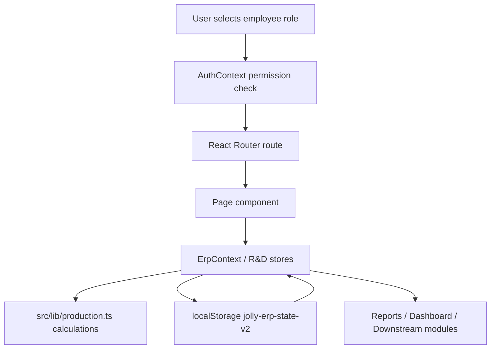
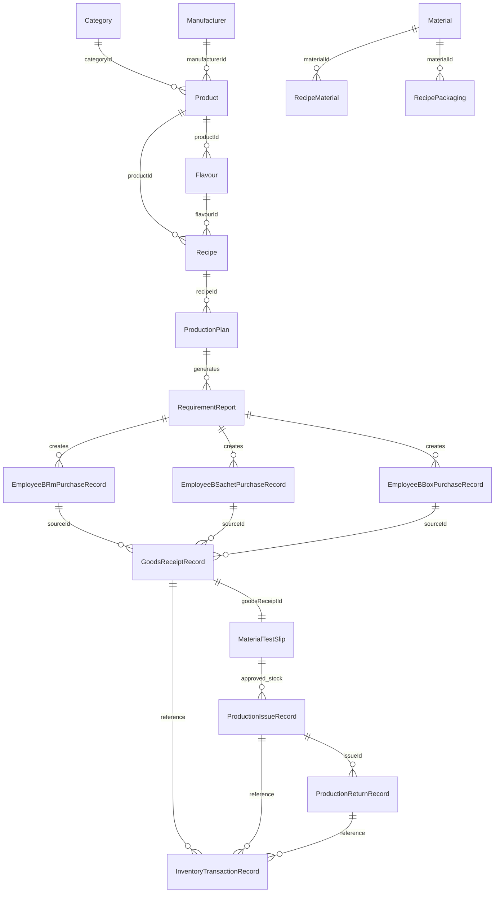
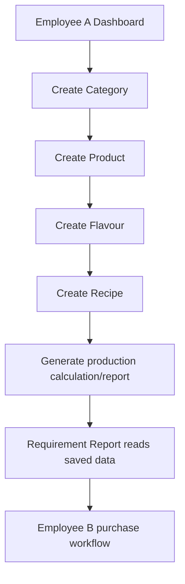
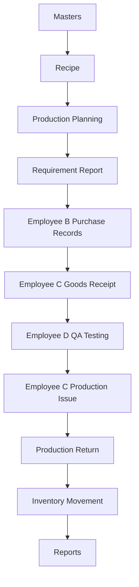
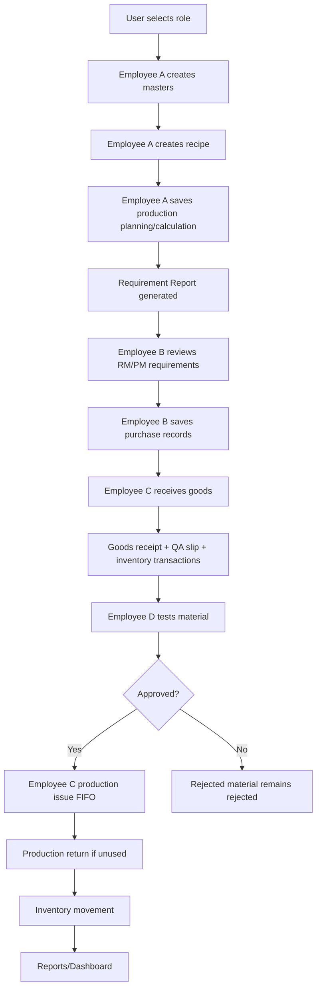
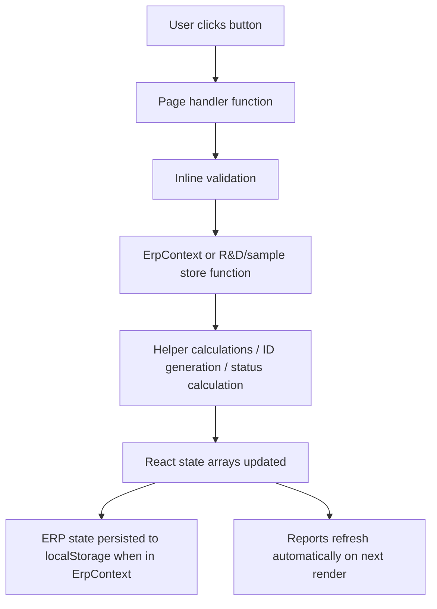
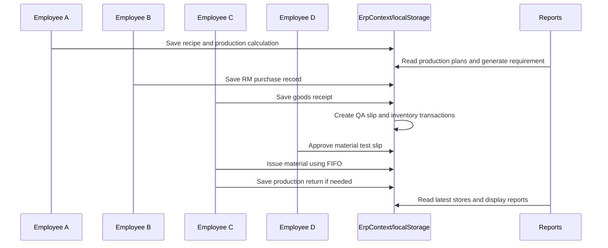

# ERP SYSTEM DOCUMENTATION

## 1. Project Overview

### Purpose Of Project

This project is a Manufacturing ERP prototype for product master management, recipe/formula management, production planning, requirement reporting, purchase recording, goods receipt, QA testing, production issue, production return, inventory movement, R&D formulation, and operational reports.

The current implementation is a browser-based prototype. It is useful for demonstrating ERP workflows and validating business flow, but it is not a production ERP backend system.

### Architecture



### Frontend

- React 19
- TypeScript
- Vite
- React Router
- Tailwind CSS
- Radix UI primitives
- Lucide React icons
- Recharts
- Framer Motion
- jsPDF, jsPDF AutoTable, XLSX for some report/export utilities

### Backend

Currently Not Implemented.

There are no backend controllers, services, repositories, REST routes, GraphQL routes, server validation, database migrations, or server-side authentication.

### Database

Currently Not Implemented as a real database.

The main ERP state is stored in React state and persisted in browser `localStorage` using the key:

```text
jolly-erp-state-v2
```

The legacy key `jolly-erp-state` is removed during state load.

### State Management

| Area | Implementation | Persistence |
|---|---|---|
| ERP core data | `src/context/ErpContext.tsx` | `localStorage` |
| Auth and permissions | `src/context/AuthContext.tsx` | React state only |
| R&D workflow | `src/pages/rnd/rndStore.ts` | module-level in-memory store |
| Employee A sample dispatch/receipt | `src/pages/employee-a/sampleInventoryStore.ts` | module-level in-memory store |

### Current Implementation Level

The project is a functional prototype. It supports many ERP screens and flows, but major production ERP infrastructure is missing: backend API, database, real authentication, server authorization, transaction control, warehouse location tracking, purchase approval, financial integration, sales, GST/accounting, and full audit trail.

## 2. Complete Folder Structure

```text
D:/jolly-erp
  public/
  src/
    assets/
    components/
      auth/
      layout/
      ui/
    context/
    lib/
    pages/
      employee-a/
      employee-b/
      employee-c/
      employee-d/
      masters/
      rnd/
  dist/
  tmp_xlsx_1/
  tmp_xlsx_read/
```

| Folder / File | Responsibility |
|---|---|
| `src/App.tsx` | Defines all application routes and permission wrappers. |
| `src/main.tsx` | React app bootstrap. |
| `src/context/AuthContext.tsx` | Hardcoded users, roles, permissions, current role switching. |
| `src/context/ErpContext.tsx` | Main ERP data models, persisted state, CRUD actions, purchase/receipt/issue/return logic. |
| `src/lib/production.ts` | Recipe, production, raw material, packaging, box planning, and consolidated requirement calculations. |
| `src/lib/utils.ts` | Shared class name helper. |
| `src/components/auth/RequirePermission.tsx` | Permission guard for routes. |
| `src/components/layout/AppLayout.tsx` | Main application shell with sidebar/top navigation outlet. |
| `src/components/layout/Sidebar.tsx` | Role-based navigation menu. |
| `src/components/layout/TopNav.tsx` | Top bar and user selector. |
| `src/components/ui/*` | Local UI wrappers for button, card, dialog, input, label, select, table, tabs, badge. |
| `src/pages/masters/*` | Category, product, flavour, manufacturer, material, vendor, assorted configuration screens. |
| `src/pages/employee-a/*` | Employee A sample receipt workflow. |
| `src/pages/employee-b/*` | RM requirement, PM requirement, R&D sample requirement, Employee B purchase master report. |
| `src/pages/employee-c/*` | Goods receipt, production issue, production return. |
| `src/pages/employee-d/*` | Pending material testing approval/rejection. |
| `src/pages/rnd/*` | R&D dashboard, sample inventory, base formulation, trial worksheet, assessment, history, formula library, reports. |
| `src/pages/Reports.tsx` | Main reports and inventory movement views. |
| `src/pages/MasterReport.tsx` | Master production-style report. |
| `src/pages/RecipeManagement.tsx` | Standalone recipe management and production calculation screen. |
| `dist/` | Built production output. |
| `tmp_xlsx_1/`, `tmp_xlsx_read/` | Temporary spreadsheet extraction folders, not application modules. |

## 3. Complete Database Documentation

There is no SQL database. The following tables are logical client-side stores in `ErpContext`.

### Logical Database Diagram



### `categories`

| Item | Detail |
|---|---|
| Purpose | Product category master. |
| Columns | `id`, `code`, `name`, `description`, `status`, `createdDate`. |
| Primary Key | `id` by convention only. |
| Foreign Keys | None enforced. |
| Relationships | Referenced by `products.categoryId`. |
| Used By | Categories page, Products page, Product Details, Reports/Dashboard. |
| Status Values | `Active`, `Inactive`. |
| Dummy Data | Empty default array in current code. |

### `products`

| Item | Detail |
|---|---|
| Purpose | Product master. |
| Columns | `id`, `code`, `name`, `categoryId`, `manufacturerId`, `shelfLife`, `expiryRequired`, `description`, `status`. |
| Primary Key | `id` by convention only. |
| Foreign Keys | `categoryId`, optional `manufacturerId`; not database-enforced. |
| Relationships | Parent for `flavours`, `recipes`, `productionPlans`, assorted calculations. |
| Used By | Products, Product Details, Manage Flavours, Recipe Management, Reports, Dashboard. |
| Status Values | `Active`, `Inactive`. |
| Dummy Data | Empty default array in current code. |

### `flavours`

| Item | Detail |
|---|---|
| Purpose | Product flavour master. |
| Columns | `id`, `name`, `productId`, `status`. |
| Primary Key | `id` by convention only. |
| Foreign Keys | `productId`; not database-enforced. |
| Relationships | Referenced by `recipes.flavourId`, `productionPlans.flavourId`, recipe box assorted configuration. |
| Used By | Manage Flavours, Flavours, Flavour Details, Recipe Management, Reports. |
| Status Values | `Active`, `Inactive`. |
| Dummy Data | Empty default array in current code. |

### `manufacturers`

| Item | Detail |
|---|---|
| Purpose | Manufacturer master. |
| Columns | `id`, `name`, `contactPerson`, `gst`, `address`, `mobile`, `email`, `status`. |
| Primary Key | `id` by convention only. |
| Foreign Keys | None. |
| Relationships | Referenced by product and production plan. |
| Used By | Manufacturers, Products, Master Report. |
| Status Values | `Active`, `Inactive`. |
| Dummy Data | Empty default array in current code. |

### `materials`

| Item | Detail |
|---|---|
| Purpose | Raw material and packaging material master with stock fields. |
| Columns | `id`, `code`, `name`, `type`, `unit`, `shelfLife`, `expiryRequired`, `supplier`, `status`, `stock`, `minStock`, `packWeightKg`, `lastUpdated`, `qaStatus`. |
| Primary Key | `id` by convention only. |
| Foreign Keys | None. |
| Relationships | Referenced by recipe RM rows, recipe packaging rows, purchase/receipt/issue/return records. |
| Used By | Materials, Recipe Management, Flavour Details, RM Requirement, PM Requirement, Goods Receipt, Production Issue, Production Return, Reports. |
| Status Values | `Active`, `Inactive`; QA: `Purchased`, `Goods Inward`, `Under Testing`, `Test Approved`, `Test Rejected`. |
| Dummy Data | Empty default array in current code. |

### `vendors`

| Item | Detail |
|---|---|
| Purpose | Vendor master. |
| Columns | `id`, `code`, `name`, `manufacturerName`, `vendorTypes`, `status`, `contactPerson`, `mobile`, `alternateMobile`, `email`, `website`, `address`, `city`, `state`, `country`, `pinCode`, `gstNumber`, `panNumber`, `paymentTerms`, `leadTimeDays`, `materialIds`, `documents`, `createdDate`, `updatedDate`. |
| Primary Key | `id` by convention only. |
| Relationships | Links to material IDs. |
| Used By | Vendor Management, Employee B/C/D side navigation access. |
| Status Values | `Active`, `Inactive`, `Blocked`. |
| Validations | Name required and unique, GST unique if present, email pattern, 10 digit mobile. |
| Dummy Data | Empty default array in current code. |

### `vendorHistoryRecords`

| Item | Detail |
|---|---|
| Purpose | Vendor create/update/delete audit trail. |
| Columns | `id`, `vendorId`, `action`, `actionDate`, `description`. |
| Status Values | Action: `Created`, `Updated`, `Deleted`. |
| Used By | Vendor Management. |

### `recipes`

| Item | Detail |
|---|---|
| Purpose | Formula/BOM and packaging configuration. |
| Columns | `id`, `productId`, `flavourId`, `version`, `masterQuantity`, `batchSize`, `packSize`, `servingSize`, `materials`, `packaging`, `boxConfig`. |
| Primary Key | `id` by convention only. |
| Relationships | Product, flavour, materials, packaging materials, production plan. |
| Used By | Recipe Management, Flavour Details, Production Planning, Requirement Report, Master Report. |
| Validations | Formula total must equal master formula, product/flavour/version/batch/pack required. |
| Dummy Data | Empty default array in current code. |

### `productionPlans`

| Item | Detail |
|---|---|
| Purpose | Saved production planning records. |
| Columns | `id`, `productId`, `flavourId`, `recipeId`, `manufacturerId`, `batch`, `mfgDate`, `quantity`, `type`, `status`. |
| Status Values | `Draft`, `Pending Approval`, `Approved`. |
| Used By | Reports, RM Requirement, PM Requirement, Master Report, Dashboard. |
| Dummy Data | Empty default array in current code. |

### `productionCalculations`

| Item | Detail |
|---|---|
| Purpose | Saved final production calculation summary. |
| Columns | `recipeId`, `productId`, `flavourId`, `productionKg`, `finishedSachets`, `flavouredRatio`, `assortedRatio`, `flavouredSachets`, `assortedSachets`, `sachetsPerFlavouredBox`, `flavouredBoxes`. |
| Used By | PM Requirement, Reports. |

### Purchase, Receipt, QA, Issue, Return, Inventory Stores

| Store | Purpose | Important Fields |
|---|---|---|
| `rmPurchaseRecords` | Employee B raw material purchase records | material, required quantity, purchased quantity, price, supplier, PO, expiry, status |
| `sachetPurchaseRecords` | Employee B sachet/roll purchase records | product, materialId, required quantity, purchase unit, purchased quantity, roll weight, prices, status |
| `boxPurchaseRecords` | Employee B box purchase records | product, flavoured/assorted material IDs, required boxes, purchased quantities, prices, status |
| `goodsReceiptRecords` | Employee C receipt records | source, material, purchase quantity, received quantity, QA sample, available quantity, remaining quantity, status |
| `materialTestSlips` | Employee D QA slips | receipt link, material, received quantity, QA sample, remaining quantity, status, remarks |
| `productionIssueRecords` | Employee C issue records | material, approved available quantity, issued quantity, FIFO batches, batch number, status |
| `productionReturnRecords` | Employee C return records | issue link, returned quantity, actual consumption, remaining returnable, reason, status |
| `inventoryTransactions` | Inventory movement ledger | transaction type, quantity, delta, material, date, reference module, status |

## 4. Complete Master Modules

### Category Master

Route: `/masters/categories`

Purpose: Maintain product categories.

Fields:

| Field | Type | Required | Meaning |
|---|---|---|---|
| Code | Text | Yes | Category code. |
| Name | Text | Yes | Category display name. |
| Description | Text | Optional | Category description. |
| Status | Select | Yes | Active/Inactive. |
| Created Date | Date/string | System/manual in object | Creation date. |

Buttons:

| Button | Behavior |
|---|---|
| Add Category | Opens add dialog. |
| Edit | Opens dialog with selected category. |
| Delete | Removes category and related product/report data according to current context cleanup logic. |
| Save | Adds or updates category after form validation. |
| Cancel | Closes dialog. |

### Product Master

Route: `/masters/products`

Purpose: Maintain products and navigate to product-specific flavours and recipe setup.

Fields:

| Field | Type | Required | Meaning |
|---|---|---|---|
| Product Code | Text | Yes | Product code. |
| Product Name | Text | Yes | Product name. |
| Category | Select | Yes | Parent category. |
| Manufacturer | Select | Optional | Linked manufacturer. |
| Shelf Life | Number | Yes | Shelf life period. |
| Expiry Required | Checkbox/select | Yes | Whether expiry date is required. |
| Description | Text | Optional | Notes. |
| Status | Select | Yes | Active/Inactive. |

Buttons:

| Button | Behavior |
|---|---|
| Add Product | Opens product dialog. |
| View | Opens product details. |
| Manage Flavours | Opens product-scoped flavour page. |
| Edit | Opens product dialog in edit mode. |
| Delete | Removes product and linked records according to current cleanup logic. |
| Save | Adds or updates product. |

### Flavour Master

Routes:

- `/masters/flavours`
- `/masters/products/:id/flavours`

Purpose: Maintain flavours for products.

Fields:

| Field | Type | Required | Meaning |
|---|---|---|---|
| Flavour Name | Text | Yes | Flavour name. |
| Product | Select/route parameter | Yes | Product owner. |
| Status | Select | Yes | Active/Inactive. |
| Description | Text | Optional where available | Notes. |

Buttons:

| Button | Behavior |
|---|---|
| Add Flavour | Opens add dialog. |
| Edit | Opens edit dialog. |
| Delete | Deletes flavour if allowed by current context cleanup logic. |
| Manage Recipes | Navigates to flavour detail / recipe screen. |

### Manufacturer Master

Route: `/masters/manufacturers`

Purpose: Maintain manufacturers.

Fields: name, contact person, GST, address, mobile, email, status.

Buttons: add, edit, delete, save, cancel.

### Material Master

Route: `/masters/materials`

Purpose: Maintain raw and packaging materials.

Fields:

| Field | Type | Required | Meaning |
|---|---|---|---|
| Code | Text | Yes | Material code. |
| Name | Text | Yes | Material name. |
| Type | Select | Yes | Raw Material or Packaging Material. |
| Unit | Text/select | Yes | Stock unit such as kg, Nos, Roll. |
| Shelf Life | Number | Optional/required by form | Shelf life. |
| Expiry Required | Boolean | Yes | Whether expiry applies. |
| Supplier | Text | Optional | Supplier name. |
| Stock | Number | Optional | Current stock. |
| Minimum Stock | Number | Optional | Low stock threshold. |
| Pack Weight Kg | Number | Optional | Used for roll packaging. |
| QA Status | Status | System | Latest QA state. |
| Status | Select | Yes | Active/Inactive. |

Buttons: add material, edit, delete, save, cancel.

### Vendor Master

Route: `/masters/vendors`

Purpose: Maintain vendors and vendor history.

Fields: vendor name, manufacturer name, vendor types, status, contact person, mobile, alternate mobile, email, website, address, city, state, country, pin code, GST, PAN, payment terms, lead time days, material assignments, GST certificate, FSSAI certificate, COA sample, agreement, other documents.

Validations:

- Vendor name required.
- Vendor name unique.
- GST number unique when present.
- Email must be valid when present.
- Mobile must be 10 digits when present.

Actions:

- Create vendor.
- Edit vendor.
- Delete vendor.
- Record vendor history for create/update/delete.

### Recipe Master

Routes:

- `/recipes`
- `/masters/products/:productId/flavours/:flavourId`

Purpose: Create formula, raw material rows, packaging rows, box configuration, and final production calculation records.

Fields:

| Field | Type | Required | Meaning |
|---|---|---|---|
| Product | Select | Yes | Product owner. |
| Flavour | Select | Yes | Flavour owner. |
| Recipe Version | Text | Yes | Recipe version label. |
| Master Quantity | Number | Yes | Formula base, commonly 100 grams. |
| Batch Size | Number | Yes | Default batch kg. |
| Pack Size | Text | Yes | Pack label. |
| Serving Size | Text | Optional | Serving grams used for sachet calculation. |
| Ingredient Material | Text/manual input in current testing flow | Yes per row | Ingredient name/material field. |
| Ingredient Quantity | Number | Yes | Formula quantity. |
| Ingredient Unit | Text | Yes | Stored/display unit. |
| Make | Text | Optional | Manufacturer/make note. |
| Packaging Material | Text/manual or select depending section | Yes per row | Packaging material name/material field. |
| Packaging Unit | Select | Yes | Nos or Roll. |
| Count | Number | Optional | Packaging count when used. |
| Roll Weight Kg | Number | Required for roll calculation | Roll weight. |
| Empty Sachet Weight G | Number | Required for roll calculation | Sachet film weight. |
| Wastage Percent | Number | Optional | Packaging wastage. |

Main validations:

- Product required.
- Flavour required.
- Version required.
- Batch size greater than zero.
- Pack size required.
- Formula total must equal the master formula quantity.
- Packaging rows require material and valid roll details where applicable.

## 5. Employee A Workflow

Employee A responsibilities:

- Maintain categories, products, flavours, recipes, assorted configuration.
- View reports and master report.
- Use R&D pages.
- Receive pending samples in Employee A sample inventory.

Workflow:



Employee A sample receipt:

```text
Pending sample dispatches
↓
Open receive dialog
↓
Enter receive date, received by, remarks
↓
Receive sample
↓
Sample dispatch status becomes Received by R&D
↓
Sample inventory record is created/updated
```

## 6. Employee B Workflow

### RM Requirement

Route: `/employee-b/rm-requirement`

Data sources:

- `productionPlans`
- `recipes`
- `materials`
- `rmPurchaseRecords`

Current behavior:

1. Reads saved production plans.
2. Finds matching recipes.
3. Calculates raw material requirements.
4. Groups raw materials material-wise.
5. Displays requirement quantity, stock, balance, and purchase action.
6. Employee B creates or edits purchase record.

Important fields:

| Field | Meaning |
|---|---|
| Material Name | Raw material to purchase. |
| Required Quantity | Quantity calculated from production plans. |
| Unit | Material unit, expected kg for RM requirement display. |
| Available Stock | Current material stock. |
| Balance To Purchase | Required minus available stock. |
| Purchased Quantity | Manual purchase order quantity. |
| Expiry Date | Expiry date for FIFO/expiry tracking. |
| Price Per Unit | Purchase price. |
| Supplier Name | Vendor/supplier text. |
| PO Number | Purchase order number. |
| Expected Delivery | Expected delivery date/time. |
| Receiver Location | Delivery location. |
| Documents | File names only; actual files are not persisted. |
| Remarks | Notes. |
| Status | Pending/Ordered/In Transit/Delivered. |

### PM Requirement

Route: `/employee-b/pm-requirement`

Data sources:

- `productionPlans`
- `recipes`
- `materials`
- `productionCalculations`
- `assortedBoxCalculations`
- `sachetPurchaseRecords`
- `boxPurchaseRecords`

Sachet/roll logic:

- Sachet requirements are derived from production finished units and recipe packaging rows.
- Purchase can be stored in Roll or Nos.
- Roll purchase tracks roll weight and total weight.

Box logic:

- Flavoured and assorted box requirements are derived from production/box calculations.
- Box purchases store separate flavoured and assorted purchase quantities and prices.

### Employee B Master Report

Route: `/employee-b/master-report`

Purpose: Summarizes Employee B purchase activity.

Data sources:

- RM purchase records
- Sachet purchase records
- Box purchase records

It displays purchase totals and status summaries. Some print/export buttons are present but are not fully implemented as universal export workflows.

## 7. Employee C Workflow

### Goods Receipt

Route:

- `/employee-c/goods-receipt`
- `/employee-c/goods-receipt/:materialType/:sourceId`
- `/employee-c/goods-receipt/:materialType/:sourceId/:lineType`

Data sources:

- Employee B RM purchases
- Employee B sachet purchases
- Employee B box purchases
- Existing goods receipt records

Receipt calculation:

```text
availableQuantity = receivedQuantity - qaSampleQuantity
pendingQuantity = purchaseQuantity - totalPreviouslyReceived
status = Pending / Partially Received / Completed
```

Validations:

- Received quantity must be greater than zero.
- Received quantity cannot exceed pending quantity.
- QA sample cannot be negative.
- QA sample cannot exceed received quantity.
- Received by is required.

On save:

- Creates `goodsReceiptRecords`.
- Creates `materialTestSlips` with `Under Testing`.
- Creates inventory transaction for `Goods Inward`.
- Creates inventory transaction for `QA Sample Consumption`.
- Increases `materials.stock` by available quantity.

### Production Issue

Route:

- `/employee-c/production-issue`
- `/employee-c/production-issue/:materialId`

Data source:

- `materialTestSlips` where status is `Test Approved`.
- Linked `goodsReceiptRecords`.

FIFO:

Implemented during issue.

Sort order:

1. Expiry date ascending.
2. Received date ascending.
3. Receipt ID ascending.

On issue:

- Deducts from goods receipt remaining quantity.
- Deducts from material test slip remaining quantity.
- Creates production issue record.
- Reduces material master stock.
- Creates inventory transaction.

### Production Return

Route:

- `/employee-c/production-return`
- `/employee-c/production-return/:issueId`

On return:

- Saves return quantity.
- Calculates actual consumption.
- Updates remaining returnable quantity.
- Increases material stock.
- Creates inventory transaction.

Gap: return stock does not restore original FIFO receipt batch quantity.

## 8. Inventory System

| Concept | Current Status |
|---|---|
| Current Stock | Implemented as `materials.stock`. |
| Available Stock | Partly implemented through goods receipt/test slip remaining quantity. |
| Reserved Stock | Currently Not Implemented. |
| Issued Stock | Implemented through `productionIssueRecords` and negative inventory transactions. |
| Returned Stock | Implemented through `productionReturnRecords` and positive inventory transactions. |
| Rejected Stock | QA rejection status exists; separate rejected stock ledger not implemented. |
| Production Stock | Currently Not Implemented as separate stock. |
| Warehouse | Logical only; no warehouse table/location/bin. |
| Location | Receiver location captured in purchase, not a warehouse stock dimension. |
| Batch/Lot | Batch number on issue; receipt IDs used internally for FIFO. Dedicated lot table not implemented. |
| Inventory Movement | Implemented as `inventoryTransactions`. |
| Stock Ledger | Partly implemented as movement records. Running balance is optional and not consistently calculated. |

## 9. Manufacturing Workflow

Implemented manufacturing flow:



Calculations:

- Formula scaling uses production quantity against recipe master quantity.
- Raw material requirement derives from recipe ingredient quantity.
- Serving size drives finished sachets.
- Packaging requirement derives from finished sachets.
- Roll requirement uses roll weight and empty sachet weight.
- Box planning uses flavoured/assorted percentages and sachets per box.

Currently Not Implemented:

- Finished goods receipt as a complete workflow.
- Production completion.
- Production order closure.
- Actual consumed material reconciliation against recipe.
- WIP stock.
- Machine/labor costing.

## 10. Packaging Workflow

Packaging material is stored in the same material master with type `Packaging Material`.

Supported packaging concepts:

- Sachets
- Rolls
- Boxes
- Flavoured boxes
- Assorted boxes

Partially supported:

- Labels and cartons can exist as packaging material records if users create them.
- Roll calculation supports roll weight and empty sachet weight.
- Box calculation supports assorted and flavoured splits.

Currently Not Implemented:

- Separate packaging warehouse.
- Remaining packaging batch restore on return.
- Label/carton-specific workflow.
- Packaging production completion.

## 11. Reports

### Main Reports

Route: `/reports`

| Report | Data Source | Purpose |
|---|---|---|
| Requirement Report | production plans, recipes, materials, production calculations | Consolidated RM/PM requirement. |
| Production Report | production plans, recipes, products, flavours | Production planning summary. |
| Packaging Report | production plans, recipes, packaging config | Packaging requirement summary. |
| Material Report | materials | Material stock and master status. |

Requirement Report columns:

- Material Name
- Required Quantity
- Unit

Inventory Movement route: `/inventory-movement`

Views:

- Goods Receipt
- Production Issue
- Production Return
- Finished Goods
- Inventory Movement

Filters:

- Search
- Date range
- Status
- Material
- Batch
- Transaction type where applicable

Export/Print:

- R&D reports include Excel/PDF/print utilities.
- Main operational reports contain UI buttons/controls, but full export behavior is not consistently implemented for every report.

## 12. APIs

Currently Not Implemented as HTTP APIs.

Internal context actions act as service/API substitutes:

| Function | Purpose |
|---|---|
| `addCategory`, `updateCategory`, `removeCategory` | Category CRUD. |
| `addProduct`, `updateProduct`, `removeProduct` | Product CRUD and linked cleanup. |
| `addFlavour`, `updateFlavour`, `removeFlavour` | Flavour CRUD and linked cleanup. |
| `addManufacturer`, `updateManufacturer`, `removeManufacturer` | Manufacturer CRUD. |
| `addMaterial`, `updateMaterial`, `removeMaterial` | Material CRUD. |
| `addVendor`, `updateVendor`, `removeVendor` | Vendor CRUD with validation and history. |
| `addRecipe`, `updateRecipe`, `removeRecipe` | Recipe CRUD. |
| `addProductionPlan` | Upsert production plan. |
| `upsertProductionCalculation` | Save final production calculation. |
| `upsertAssortedBoxCalculation` | Save assorted box calculation. |
| `saveRmPurchaseRecord` | Save Employee B RM purchase. |
| `saveSachetPurchaseRecord` | Save Employee B sachet purchase. |
| `saveBoxPurchaseRecord` | Save Employee B box purchase. |
| `saveGoodsReceipt` | Save receipt, test slip, transactions, stock. |
| `saveMaterialTestDecision` | Approve/reject material test slip. |
| `saveProductionIssue` | FIFO issue approved stock. |
| `saveProductionReturn` | Save return and inventory movement. |
| `generateProductionSummary` | Calculate production summary from recipe. |

## 13. Frontend Pages

| Page | Route | Components/State |
|---|---|---|
| Dashboard | `/` | Reads ERP counts, charts, recent plans. |
| Categories | `/masters/categories` | Dialog form, table, category actions. |
| Products | `/masters/products` | Product table, add/edit dialog, navigation buttons. |
| Product Details | `/masters/products/:id` | Product info and linked flavour/recipe navigation. |
| Manage Flavours | `/masters/products/:id/flavours` | Product-scoped flavour table and dialog. |
| Flavour Details | `/masters/products/:productId/flavours/:flavourId` | Recipe and production calculation workflow. |
| Assorted Configuration | `/masters/products/:productId/assorted-configuration` | Assorted flavour selection and box settings. |
| Manufacturers | `/masters/manufacturers` | Manufacturer CRUD. |
| Materials | `/masters/materials` | Material CRUD and stock fields. |
| Vendor Management | `/masters/vendors` | Vendor CRUD/history/documents. |
| Recipe Management | `/recipes` | Standalone recipe, RM/PM, final calculation. |
| Employee A Sample Inventory | `/employee-a/sample-inventory` | Pending sample receive and inventory view. |
| RM Requirement | `/employee-b/rm-requirement` | RM requirement and purchase form. |
| PM Requirement | `/employee-b/pm-requirement` | Sachet/box requirement and purchase forms. |
| R&D Sample Requirement | `/employee-b/rnd-sample-requirement` | Sample request/dispatch view. |
| Employee B Master Report | `/employee-b/master-report` | Purchase summary. |
| Goods Receipt | `/employee-c/goods-receipt` | Receive RM/PM purchases. |
| Production Issue | `/employee-c/production-issue` | Issue approved stock with FIFO. |
| Production Return | `/employee-c/production-return` | Return unused material. |
| Pending Material Tests | `/employee-d/pending-material-tests` | QA approval/rejection. |
| Reports | `/reports` | Main reports. |
| Inventory Movement | `/inventory-movement` | Inventory transaction views. |
| Master Report | `/master-report` | Production-style master report. |
| R&D Dashboard | `/rnd` | R&D summary. |
| R&D Sample Inventory | `/rnd/sample-inventory` | Receive/issue/adjust sample stock. |
| Base Formulation | `/rnd/base-formulation` | Build base formula. |
| Trial Worksheet | `/rnd/trial-worksheet` | Create trial from base formula. |
| Trial Assessment | `/rnd/trial-assessment` | Assess trial. |
| Trial History | `/rnd/trial-history` | Trial records. |
| Formula Library | `/rnd/formula-library` | Version approved formulas. |
| R&D Reports | `/rnd/reports` | R&D report tables and export. |

## 14. Backend Logic

Currently Not Implemented.

Equivalent client-side business logic exists in:

- `ErpContext.tsx` for CRUD, persistence, stock updates, QA decisions, FIFO issue, returns.
- `production.ts` for production calculations.
- `rndStore.ts`, `baseFormulaUtils.ts`, `trialWorksheetUtils.ts`, `rndReportsData.ts`, `rndReportExports.ts` for R&D.

## 15. Business Logic

### Formula And Production

- Recipe is the source of truth for formula and packaging setup.
- Production quantity scales recipe material quantities.
- Requirement reports read saved production plans automatically.
- Raw material requirements are consolidated material-wise.
- Packaging requirements are consolidated material-wise where implemented.

### Purchase

- Purchase records are created by Employee B.
- Purchase quantity can be greater than required quantity.
- Multiple purchase records can exist.
- Purchase status is manually selected and not automatically synchronized with goods receipt.

### Goods Receipt

- Receipt is against Employee B purchase records.
- Partial receipt is supported.
- Receipt cannot exceed pending quantity.
- QA sample is deducted from received quantity to produce available quantity.

### QA

- Every goods receipt creates an `Under Testing` test slip.
- Employee D approves or rejects.
- Production Issue only reads `Test Approved` slips.

### FIFO

- FIFO is implemented only when issuing material.
- The oldest expiry date is used first.
- If expiry is missing, a far-future fallback date is used.

## 16. Current Dummy Logic

| Area | Classification |
|---|---|
| Auth users | Hardcoded prototype users. |
| Permissions | Hardcoded role permission map. |
| Database | Browser localStorage, not real DB. |
| APIs | Not implemented. |
| Master defaults | Empty default arrays in current context. |
| R&D store | In-memory prototype store. |
| Employee A sample store | In-memory prototype store. |
| File uploads | File names only; binary files are not persisted. |
| Export buttons | Mixed: R&D exports implemented, other exports partly placeholder. |
| Warehouse | Logical only. |
| Dispatch from B to C | Not separately implemented. |

## 17. Missing Features

- [ ] Backend database.
- [ ] REST/GraphQL APIs.
- [ ] Server authentication.
- [ ] Server authorization.
- [ ] Employee master management.
- [ ] Role master management.
- [ ] Purchase approval workflow.
- [ ] Purchase dispatch workflow.
- [ ] Vendor-wise PO generation document.
- [ ] Pending purchase balance dashboard.
- [ ] Warehouse master.
- [ ] Bin/location stock.
- [ ] Batch/lot master.
- [ ] QA quarantine stock separation.
- [ ] Rejected stock ledger.
- [ ] Reserved stock.
- [ ] Finished goods receipt workflow.
- [ ] Production completion workflow.
- [ ] WIP stock.
- [ ] Actual production consumption reconciliation.
- [ ] Packaging consumption ledger.
- [ ] Sales dispatch.
- [ ] Accounting.
- [ ] GST.
- [ ] Full audit trail.
- [ ] Database indexes and constraints.
- [ ] Real file storage.
- [ ] Universal Excel/PDF export.

## 18. Existing Bugs / Risks

| Problem | Location | Reason | Impact | Suggested Solution |
|---|---|---|---|---|
| No backend persistence | Whole app | localStorage only | Data is browser/device-specific | Add backend API and database. |
| Stock added before QA approval | `saveGoodsReceipt` | Material stock increases at receipt time | Available stock may include unapproved material in some reports | Separate physical, quarantine, approved stock. |
| Purchase status not auto-updated | Employee B/C flow | Receipt does not update purchase record status | Purchase history may not reflect actual receipt state | Link receipt totals back to purchase status. |
| Return does not restore FIFO batch | `saveProductionReturn` | Only material stock increases | Batch-level traceability incomplete | Return to original consumed batch or return batch. |
| No real file persistence | Purchase/vendor documents | Stores file names only | Documents unavailable after browser file reference lost | Add file storage. |
| No server validation | Whole app | Client only | Data integrity can be bypassed | Add API validation. |
| No concurrency control | Whole app | localStorage only | Multi-user workflow impossible | Add DB transactions/versioning. |
| Some matching fallback by name | PM/goods receipt | Missing material IDs in old records | Wrong material could be linked | Enforce material IDs. |
| Export inconsistency | Reports | Some buttons are present without full action | User expects files but may not receive them | Implement export uniformly. |

## 19. Real ERP Comparison

Compared with a real manufacturing ERP, the prototype has the correct high-level idea but lacks enterprise controls.

Missing or incomplete ERP-grade capabilities:

- Database-backed master and transaction records.
- Proper document numbers for PO, GRN, issue, return, batch, lot.
- Approval matrix.
- Material reservation.
- Separate stock buckets: ordered, in-transit, received, quarantine, approved, rejected, issued, returned, WIP, finished goods.
- Warehouse/bin/location.
- Accounting and tax postings.
- Audit trail for all changes.
- User management and password/session security.
- Role and permission master.
- Integration with vendors, purchase, inventory, production, sales, finance.

## 20. End-To-End Workflow



## 21. File Reference

| Module | Files |
|---|---|
| Routing | `src/App.tsx` |
| Auth/permissions | `src/context/AuthContext.tsx`, `src/components/auth/RequirePermission.tsx` |
| ERP store/database substitute | `src/context/ErpContext.tsx` |
| Layout/navigation | `src/components/layout/AppLayout.tsx`, `Sidebar.tsx`, `TopNav.tsx` |
| UI components | `src/components/ui/*` |
| Calculations | `src/lib/production.ts` |
| Dashboard | `src/pages/Dashboard.tsx` |
| Categories | `src/pages/masters/Categories.tsx` |
| Products | `src/pages/masters/Products.tsx`, `ProductDetails.tsx` |
| Flavours | `src/pages/masters/Flavours.tsx`, `ManageFlavours.tsx`, `FlavourDetails.tsx` |
| Assorted configuration | `src/pages/masters/AssortedConfiguration.tsx` |
| Manufacturers | `src/pages/masters/Manufacturers.tsx` |
| Materials | `src/pages/masters/Materials.tsx` |
| Vendors | `src/pages/masters/VendorManagement.tsx` |
| Recipe management | `src/pages/RecipeManagement.tsx` |
| Employee A sample inventory | `src/pages/employee-a/PendingSampleReceipts.tsx`, `sampleInventoryStore.ts` |
| Employee B RM | `src/pages/employee-b/RmRequirement.tsx` |
| Employee B PM | `src/pages/employee-b/PmRequirement.tsx` |
| Employee B sample requirement | `src/pages/employee-b/RndSampleRequirement.tsx` |
| Employee B master report | `src/pages/employee-b/EmployeeBMasterReport.tsx` |
| Employee C goods receipt | `src/pages/employee-c/GoodsReceipt.tsx` |
| Employee C issue | `src/pages/employee-c/ProductionIssue.tsx` |
| Employee C return | `src/pages/employee-c/ProductionReturn.tsx` |
| Employee D testing | `src/pages/employee-d/PendingMaterialTests.tsx` |
| Reports/inventory movement | `src/pages/Reports.tsx` |
| Master report | `src/pages/MasterReport.tsx` |
| R&D | `src/pages/rnd/*` |

## 22. Future Development Roadmap

### Phase 1: Stabilize Prototype

- Add consistent validations to all forms.
- Add unique code checks for masters.
- Add missing delete protections for all referenced records.
- Implement consistent PDF/Excel/print exports.
- Replace name-based material matching with strict IDs.
- Separate approved stock from received/quarantine stock.

### Phase 2: Backend And Database

- Add backend API.
- Add relational database.
- Add migrations.
- Add authentication.
- Add role and employee masters.
- Add audit log.
- Add transaction handling.

### Phase 3: Purchase And Inventory

- Add purchase requisition.
- Add PO approval.
- Add purchase dispatch/in-transit tracking.
- Add GRN numbering.
- Add partial receipt balance.
- Add rejected material workflow.
- Add warehouse, location, bin, batch, lot, expiry.
- Add stock ledger with running balances.

### Phase 4: Manufacturing

- Add production order.
- Add material reservation.
- Add production issue against production order.
- Add actual consumption.
- Add production return to batch/location.
- Add WIP.
- Add finished goods receipt.
- Add production closure.

### Phase 5: Commercial ERP

- Add sales order.
- Add dispatch.
- Add invoicing.
- Add GST/tax.
- Add accounting entries.
- Add vendor/customer ledger.
- Add management dashboards.

## Appendix A: Status Reference

| Status | Area |
|---|---|
| `Active`, `Inactive` | Masters |
| `Blocked` | Vendors |
| `Draft`, `Pending Approval`, `Approved` | Production plans |
| `Pending`, `Ordered`, `In Transit`, `Delivered` | Employee B purchase records |
| `Partially Received`, `Completed` | Goods receipt |
| `Purchased`, `Goods Inward`, `Under Testing`, `Test Approved`, `Test Rejected` | Material QA |
| `Open`, `Issued` | Production issue |
| `Open`, `Partially Returned`, `Returned` | Production return |
| `Recorded` | Inventory transactions |

## Appendix B: Permission Matrix

| Role | Permissions |
|---|---|
| Boss | All available permissions. |
| Employee A | Dashboard, categories, products, recipes, assorted configuration, reports, master report, R&D, sample inventory. |
| Employee B | Dashboard, vendors, RM requirement, PM requirement, R&D sample requirement, reports, Employee B master report. |
| Employee C | Dashboard, vendors, materials, master report, goods receipt, production issue, production return, inventory movement. |
| Employee D | Dashboard, vendors, pending material tests. |

## Appendix C: Notes For New Developers

- Do not look for API calls; the project has none.
- Do not look for database migrations; the project has none.
- Treat `ErpContext.tsx` as the current database plus service layer.
- Treat `production.ts` as the source for calculation rules.
- Treat R&D stores as isolated prototype stores.
- Browser refresh preserves main ERP state through `localStorage`, but not every isolated store is persisted.
- Any future backend work should first map current logical stores into real database tables.

## Section XX: Hidden Logic Mapping

This section documents the internal workflows that happen behind visible user actions. The application has no backend API, so all hidden actions are React handlers, context methods, calculation helpers, and local store functions.

### Global Hidden Flow



### Authentication And Navigation

| Visible Action | First Function / Component | Hidden Logic | Records Affected | Modules Affected |
|---|---|---|---|---|
| Select user/role in top navigation | `setCurrentUserId` in `AuthContext` | Current user changes in React state; `canAccess` checks the selected role against hardcoded `rolePermissions`. | None. | Sidebar, protected routes, visible actions. |
| Open protected route | `RequirePermission` | Calls `canAccess(permission)` before rendering route content. | None. | All pages. |
| Sidebar link click | React Router navigation | Route is matched in `App.tsx`; permission wrapper decides access. | None. | Navigation only. |

### Master Save / Update / Delete Hidden Logic

| Module | Button | First Function | Helper Logic | Records Created / Updated / Deleted | Hidden Side Effects |
|---|---|---|---|---|---|
| Categories | Save | `handleSave` in `Categories.tsx` | Builds category object; decides add or update mode. | `categories` add/update. | Reports/dashboard re-render from context. |
| Categories | Delete | `removeCategory` in `ErpContext.tsx` | Finds products in category; calls linked cleanup through product-related state removal. | Category and linked product-dependent records may be removed. | Product/flavour/recipe/planning/report data can disappear from downstream modules. |
| Products | Save | `handleSave` in `Products.tsx` | Builds product object; decides add or update mode. | `products` add/update. | Product becomes available to flavour, recipe, reports. |
| Products | Delete | `removeProduct` in `ErpContext.tsx` | Calls `removeProductLinkedData`. | Product plus linked flavours, recipes, production plans/calculations, assorted calculations, relevant purchase/receipt/issue/return/report records. | Dashboard/reports stop showing linked product data. |
| Manage Flavours | Save | `handleSave` in `ManageFlavours.tsx` | Checks product route context and duplicate names. | `flavours` add/update. | Flavour becomes available to recipe screens. |
| Manage Flavours | Delete | `removeFlavour` in `ErpContext.tsx` | Checks/cleans linked recipe and production data. | Flavour and linked records. | Requirement/report data for that flavour disappears. |
| Manufacturers | Save | `handleSave` in `Manufacturers.tsx` | Required name validation. | `manufacturers` add/update. | Manufacturer can be selected in product/planning. |
| Manufacturers | Delete | `removeManufacturer` | Blocks if referenced by products or production records. | Manufacturer deleted only when unreferenced. | Prevents broken product/planning references. |
| Materials | Save | `handleSave` in `Materials.tsx` | Validates material name and code. | `materials` add/update. | Material appears in recipes, RM/PM requirements, inventory screens. |
| Materials | Delete | `removeMaterial` | Blocks if material is referenced by recipes. | Material deleted only when unreferenced. | Protects recipe BOM references. |
| Vendors | Save | `saveVendor` then `addVendor`/`updateVendor` | `validateVendor`, `getNextVendorCode`; create/update vendor history. | `vendors`, `vendorHistoryRecords`. | Vendor history tab/list refreshes. |
| Vendors | Delete | `deleteVendor` then `removeVendor` | Confirmation; create deleted history record. | `vendors`, `vendorHistoryRecords`. | Vendor removed but history remains. |

### Recipe And Production Hidden Logic

| Button | First Function | Hidden Helpers / Calculations | Records Affected | Reports Affected |
|---|---|---|---|---|
| Save Recipe | `saveRecipe` in `RecipeManagement.tsx` or `FlavourDetails.tsx` | Totals ingredient rows; validates formula total; normalizes material unit `%` to `kg` inside `ErpContext`; constructs packaging and box config. | `recipes` add/update. | Requirement, production, packaging, master report. |
| Delete Recipe | `removeRecipe` | Blocks deletion if referenced by production plans. | `recipes` deleted only if unreferenced. | Reports lose recipe only if deletion succeeds. |
| Load/Edit Recipe | `loadRecipe` | Copies recipe rows into local form state. | No store change until save. | None. |
| Generate / Final Report in recipe section | `generateReport` / `saveProductionCalculation` where available | Runs `calculateProduction`, packaging logic, box planning, then upserts production calculation/plan data. | `productionCalculations`, sometimes `productionPlans`. | Requirement, PM Requirement, Reports. |
| Assorted Configuration Save | `saveConfiguration` | Stores selected flavours, serving per box, total sachets, total assorted boxes. | `assortedBoxCalculations`. | PM Requirement and reports consume assorted box values. |

### Employee B Hidden Logic

| Screen | Button | First Function | Hidden Logic | Records Affected | Downstream Effect |
|---|---|---|---|---|---|
| RM Requirement | Open/Create purchase | Row select handler | Requirement rows are generated from `productionPlans` + `recipes` + `materials`; stock and balance are calculated on render. | Local form state only. | Purchase form is prefilled. |
| RM Requirement | Save Purchase | `handleSave` in `RmRequirement.tsx` | Validates selected material and purchased quantity; calculates total price. | `rmPurchaseRecords` via `saveRmPurchaseRecord`. | Employee C Goods Receipt receives new RM row. |
| PM Requirement | Save Sachet Purchase | PM save handler | Calculates roll/nos totals, total weight, total price. | `sachetPurchaseRecords`. | Employee C Goods Receipt receives sachet row. |
| PM Requirement | Save Box Purchase | PM box save handler | Calculates flavoured/assorted totals and grand total. | `boxPurchaseRecords`. | Employee C Goods Receipt receives box rows. |
| R&D Sample Requirement | Confirm Send to R&D | `confirmDispatch` | Calls `recordSampleDispatch`; updates local sample dispatch store. | `dispatchRecords` in `sampleInventoryStore.ts`. | Employee A pending sample receipt can read dispatch. |
| Employee B Master Report | Print/Export buttons | UI button handlers or placeholder | Summary data is computed from purchase arrays. | Usually none. | Some exports are placeholder/incomplete. |

### Employee C Hidden Logic

| Screen | Button | First Function | Hidden Helpers / Calculations | Records Created / Updated | Hidden Status Changes |
|---|---|---|---|---|---|
| Goods Receipt | Receive | `handleOpenRow` | Builds row from B purchase record; calculates already received and pending. | Local form state. | None. |
| Goods Receipt | Save | `handleSave` then `saveGoodsReceipt` | `getCalculatedGoodsReceiptQuantities`, `getGoodsReceiptStatus`, `resolveInventoryMaterialId`, `getInventoryTransactionId`. | Creates `goodsReceiptRecords`, `materialTestSlips`, two `inventoryTransactions`; updates `materials.stock`. | Receipt status becomes Pending/Partially Received/Completed; material QA becomes Under Testing. |
| Production Issue | Open Issue | `openIssueForm` | Aggregates approved slips and remaining receipt quantities. | Local form state. | None. |
| Production Issue | Save | `handleSave` then `saveProductionIssue` | Finds approved slips; sorts FIFO by expiry/received date/id; checks approved available stock; deducts receipt/test remaining quantity. | Creates `productionIssueRecords`, inventory transaction; updates `goodsReceiptRecords`, `materialTestSlips`, `materials.stock`. | Issue status becomes Issued; low-stock alert may show. |
| Production Return | Save | `handleSave` then `saveProductionReturn` | Totals previous returns for same issue; calculates actual consumption and remaining returnable quantity. | Creates `productionReturnRecords`, inventory transaction; updates `materials.stock`. | Return status Open/Partially Returned/Returned. |

### Employee D Hidden Logic

| Button | First Function | Hidden Logic | Records Updated | Modules Affected |
|---|---|---|---|---|
| Save Decision | `saveDecision` then `saveMaterialTestDecision` | Resolves material ID; writes QA remarks and decision; updates linked goods receipt and inventory transaction material IDs. | `materialTestSlips`, `goodsReceiptRecords`, `inventoryTransactions`, `materials.qaStatus`. | Production Issue reads approved slips; rejected slips stay unavailable. |

### R&D Hidden Logic

| Screen | Button | First Function | Hidden Logic | Store Affected |
|---|---|---|---|---|
| Base Formulation | Save | `validateAndSave` | Calculates protein contribution, total formula, serving values. | `baseFormulas`. |
| Trial Worksheet | Create / Duplicate / Save Trial | `createTrial`, `duplicateTrial`, `saveTrial` | Builds trial ingredients from base formula; calculates trial summary. | `trialRecords`. |
| Trial Assessment | Save Assessment | `saveAssessment` | Stores verdict and scoring details against trial. | `trialRecords.assessment`. |
| Formula Library | Create | `handleCreateVersion` | `buildFormulaVersionFromApprovedTrial` only works for trials approved for next stage. | `formulaVersions`. |
| Formula Library | Archive | `handleArchiveVersion` | Marks formula version archived. | `formulaVersions`. |
| R&D Sample Inventory | Receive/Issue/Adjust | `receiveSample`, `issueSample`, `adjustSampleQuantity` | Updates sample balance and history. | `sampleInventoryRecords`. |

## Section XX: Complete Variable Trace

### Production Quantity

| Lifecycle Item | Detail |
|---|---|
| Created | Entered in production/recipe calculation screens or stored as `productionPlans.quantity`. |
| Modified | Updated when production plan/calculation is regenerated or plan is overwritten by ID. |
| Used By | `calculateProduction`, RM Requirement, PM Requirement, Reports, Master Report. |
| Store | `productionPlans.quantity`, `productionCalculations.productionKg`. |
| UI | Recipe Management, Flavour Details, Reports, RM/PM Requirement. |
| Reports | Requirement Report, Production Report, Packaging Report, Master Report. |
| Final When | Production plan/calculation is saved and no later overwrite occurs. |

### Required Quantity

| Lifecycle Item | Detail |
|---|---|
| Created | Calculated from recipe formula and production quantity for RM; calculated from finished sachets/packaging config for PM. |
| Modified | Recalculated whenever production plan, recipe, material configuration, serving size, or packaging config changes. |
| Used By | Employee B purchase forms and reports. |
| Store | Mostly derived; persisted inside B purchase records as `requiredQuantity`, `flavouredBoxesRequired`, `assortedBoxesRequired`. |
| UI | RM Requirement, PM Requirement, Reports. |
| Reports | Requirement Report, Employee B Master Report. |
| Final When | Copied into a purchase record; otherwise it remains live/derived. |

### Purchased Quantity

| Lifecycle Item | Detail |
|---|---|
| Created | Employee B enters purchase quantity in RM/PM purchase forms. |
| Modified | Employee B edits existing purchase history record. |
| Used By | Goods Receipt pending quantity calculation. |
| Store | `rmPurchaseRecords.purchasedQuantity`, `sachetPurchaseRecords.purchasedQuantity`, `boxPurchaseRecords.flavouredPurchasedQuantity`, `boxPurchaseRecords.assortedPurchasedQuantity`. |
| UI | Employee B purchase history, Employee C Goods Receipt. |
| Reports | Employee B Master Report, Goods Receipt/inventory reports indirectly. |
| Final When | Purchase record is no longer edited; there is no approval lock. |

### Received Quantity

| Lifecycle Item | Detail |
|---|---|
| Created | Employee C enters in Goods Receipt. |
| Modified | Not edited after save; additional receipt creates another receipt row. |
| Used By | Available quantity, QA sample deduction, receipt status, inventory transactions. |
| Store | `goodsReceiptRecords.receivedQuantity`, `materialTestSlips.receivedQuantity`, transaction quantity for Goods Inward. |
| UI | Goods Receipt, Pending Material Tests, Inventory Movement. |
| Reports | Goods Receipt Report, Inventory Movement. |
| Final When | Receipt save completes. |

### QA Sample Quantity

| Lifecycle Item | Detail |
|---|---|
| Created | Employee C enters in Goods Receipt. |
| Used By | Available quantity calculation. |
| Store | `goodsReceiptRecords.qaSampleQuantity`, `materialTestSlips.qaSampleQuantity`, QA Sample Consumption transaction. |
| UI | Goods Receipt, Pending Material Tests, Inventory Movement. |
| Reports | Inventory Movement. |
| Final When | Receipt save completes. |

### Available Quantity

| Lifecycle Item | Detail |
|---|---|
| Created | `availableQuantity = receivedQuantity - qaSampleQuantity`. |
| Modified | Not directly edited; issue reduces `remainingQuantity`, not original available quantity. |
| Used By | Material test slip availability, production issue aggregation. |
| Store | `goodsReceiptRecords.availableQuantity`, `materialTestSlips.availableQuantity`. |
| UI | Goods Receipt, Production Issue. |
| Reports | Goods receipt/inventory movement rows. |
| Final When | Receipt is saved, although remaining available changes through issue. |

### Remaining Quantity

| Lifecycle Item | Detail |
|---|---|
| Created | Set equal to available quantity during goods receipt. |
| Modified | Reduced by `saveProductionIssue` FIFO deduction. |
| Used By | Production Issue approved stock availability. |
| Store | `goodsReceiptRecords.remainingQuantity`, `materialTestSlips.remainingQuantity`. |
| UI | Production Issue, inventory movement/report views. |
| Reports | Inventory Movement. |
| Final When | Material is fully issued or record is no longer consumed. |

### Stock

| Lifecycle Item | Detail |
|---|---|
| Created | Manual material master field or default empty/zero if not set. |
| Modified | Goods receipt increases stock; production issue decreases stock; production return increases stock; material edit can manually change it. |
| Used By | RM/PM balance, Material Report, low-stock alert. |
| Store | `materials.stock`. |
| UI | Materials, RM Requirement, PM Requirement, Production Issue, Reports. |
| Reports | Material Report, Inventory Movement. |
| Final When | Never final; it is a live balance. |

### Batch Number

| Lifecycle Item | Detail |
|---|---|
| Created | Production plan stores `batch`; Production Issue stores manually/default generated `batchNumber`. |
| Modified | User can edit before save in issue flow. |
| Used By | Production reports and inventory movement grouping/display. |
| Store | `productionPlans.batch`, `productionIssueRecords.batchNumber`, `productionReturnRecords.batchNumber`, `inventoryTransactions.batchNumber`. |
| UI | Production Report, Production Issue, Production Return, Inventory Movement. |
| Final When | Saved in production issue/return or production plan. |

### Recipe Version

| Lifecycle Item | Detail |
|---|---|
| Created | User enters while saving recipe. |
| Modified | Recipe edit/update. |
| Used By | Recipe selection and reporting labels. |
| Store | `recipes.version`. |
| UI | Recipe Management, Flavour Details, Reports. |
| Reports | Master Report/production-related displays where recipe is shown. |
| Final When | Recipe is saved and not edited. |

### Serving Size

| Lifecycle Item | Detail |
|---|---|
| Created | Recipe form field. |
| Modified | Recipe edit/update. |
| Used By | Finished sachet calculation. |
| Store | `recipes.servingSize`. |
| UI | Recipe Management, Flavour Details. |
| Reports | Production/packaging/master report calculations. |
| Final When | Recipe version is frozen by business practice; code does not lock it. |

### Finished Sachets

| Lifecycle Item | Detail |
|---|---|
| Created | `calculateProduction` divides total production grams by serving size. |
| Modified | Recalculated when production quantity or serving size changes. |
| Used By | Packaging, sachets, boxes. |
| Store | `productionCalculations.finishedSachets` when final calculation is saved; otherwise derived. |
| UI | Recipe final report, PM Requirement, Reports. |
| Reports | Production Report, Packaging Report. |
| Final When | Saved in `productionCalculations`; otherwise live. |

### Flavoured Sachets / Assorted Sachets

| Lifecycle Item | Detail |
|---|---|
| Created | Box planning splits finished sachets using flavoured and assorted ratios. |
| Modified | Recalculated when ratios, production quantity, serving size, or box config changes. |
| Store | `productionCalculations.flavouredSachets`, `productionCalculations.assortedSachets`. |
| UI | Recipe/Flavour calculation, PM Requirement, Reports. |
| Reports | Production/packaging reports. |
| Final When | Production calculation is saved. |

### Flavoured Boxes / Assorted Boxes

| Lifecycle Item | Detail |
|---|---|
| Created | Flavoured boxes from `flavouredSachets / sachetsPerFlavouredBox`; assorted boxes from assorted configuration. |
| Modified | Recalculated when box config or assorted box calculation changes. |
| Store | `productionCalculations.flavouredBoxes`, `assortedBoxCalculations.totalAssortedBoxes`, purchase records copy required quantities. |
| UI | Assorted Configuration, PM Requirement, Reports. |
| Reports | Packaging/requirement reports, Employee B Master Report. |
| Final When | Saved calculation/purchase record is no longer edited. |

### Raw Material Quantity

| Lifecycle Item | Detail |
|---|---|
| Created | Recipe material row quantity. |
| Modified | Recipe edit. |
| Used By | RM requirement and production calculation. |
| Store | `recipes.materials[].quantity`, copied into derived requirement rows and purchase records. |
| UI | Recipe Management, Flavour Details, RM Requirement. |
| Reports | Requirement Report, Master Report. |
| Final When | Recipe version and production plan are finalized. |

### Packaging Material Quantity

| Lifecycle Item | Detail |
|---|---|
| Created | Recipe packaging row and calculated from finished sachets. |
| Modified | Recipe packaging edit or production quantity change. |
| Used By | PM Requirement, Packaging Report. |
| Store | `recipes.packaging[]`, `sachetPurchaseRecords`, `boxPurchaseRecords`. |
| UI | Recipe Management, PM Requirement. |
| Reports | Requirement Report, Packaging Report, Employee B Master Report. |
| Final When | Purchase record is saved or production calculation is frozen. |

## Section XX: Unused Features Analysis

| Item | File Location | Intended Purpose | Why It Appears Unused / Placeholder | Safe To Remove? | Future Reserved? |
|---|---|---|---|---|---|
| HTTP API layer | Project-wide | Backend integration | No API files, fetch calls, controllers, or routes exist. | Not applicable. | Yes, required for real ERP. |
| Real database schema | Project-wide | Persistent ERP database | No migrations/models/backend DB code. | Not applicable. | Yes. |
| `RequirementReportSelection` | `ErpContext.tsx` | Earlier manual requirement report selection | Current requirement flow reads all saved production plans automatically; state is still persisted/exposed. | Possibly, after confirming no legacy screen needs it. | Could be legacy only. |
| `InventoryTransactionType: Goods Receipt` | `ErpContext.tsx` | Ledger transaction type | Save goods receipt creates `Goods Inward` and `QA Sample Consumption`, not `Goods Receipt`. | Keep until ledger design finalized. | Likely reserved. |
| `InventoryTransactionType: Finished Goods Receipt` | `ErpContext.tsx`, `Reports.tsx` | Finished goods inventory | Reports filter/display it, but no workflow creates it. | No, likely future workflow. | Yes. |
| `runningBalance` stored field | `InventoryTransactionRecord` | Ledger running balance | Reports calculate running balance dynamically; saved transactions usually do not set it. | Keep or formalize later. | Yes. |
| Main Reports export buttons | `Reports.tsx` | Print/Excel/PDF export | Several buttons lack full export actions; inventory export sets placeholder message. | No; implement later. | Yes. |
| Product Details inline edit icons | `ProductDetails.tsx` | Inline flavour editing | OnClick contains comment placeholder instead of edit dialog. | Could remove if Manage Flavours is canonical. | Maybe. |
| Standalone Flavours page | `Flavours.tsx` | Global flavour page | Product-scoped flavour management appears primary; route still exists. | Not without business approval. | Possibly fallback/admin use. |
| Standalone Recipe Management | `RecipeManagement.tsx` | Recipe editor/calculator | Flavour Details also manages recipes; duplication exists. | Not safe; route is active. | Could be consolidated later. |
| R&D in-memory stores | `rndStore.ts` | R&D workflow storage | Not persisted in main ERP `localStorage`. | No. | Needs real persistence. |
| Employee A sample store | `sampleInventoryStore.ts` | B-to-A/R&D sample dispatch/receipt | Module-level arrays reset on reload. | No. | Needs persistence. |
| File upload document fields | Vendor and purchase screens | Store compliance/purchase docs | Only file names are stored; file content is not persisted. | No. | Needs file storage. |
| Vendor assigned materials | `VendorManagement.tsx`, `Vendor.materialIds` | Vendor-material relationship | Purchase screens still use supplier text and do not enforce vendor selection from vendor master. | Keep. | Yes. |
| Receiver location | Purchase records | Delivery routing | Goods receipt reads purchase records but does not use receiver location as warehouse location. | Keep. | Warehouse future. |
| Purchase status Delivered | Purchase records | PO lifecycle | Receipt does not automatically set purchase status to Delivered/Completed. | Keep. | Needs workflow linkage. |
| Finished Goods tab | `Reports.tsx` | Finished goods reporting | It displays future finished goods receipt transactions, but no producer exists. | Keep. | Yes. |

## Section XX: Broken Workflow Detection

| Module | Screen | Button / Field | Expected Flow | Current Flow | Root Cause | Files Involved |
|---|---|---|---|---|---|---|
| Reports | Main Reports | Print / Export Excel / Export PDF | Generate downloadable/printable files for each report. | Some buttons are visual only or placeholder. | Export handlers not implemented consistently. | `Reports.tsx` |
| Inventory | Finished Goods | Finished Goods Receipt report | Finished goods should be created after production completion. | Report can display finished goods transactions, but no workflow creates them. | Production completion/FG receipt not implemented. | `Reports.tsx`, `ErpContext.tsx` |
| Purchase to Receipt | Employee B purchase status | Status should reflect partial/full receipt automatically. | Purchase status remains manually selected. | Goods receipt does not update Employee B purchase record status. | `RmRequirement.tsx`, `PmRequirement.tsx`, `GoodsReceipt.tsx`, `ErpContext.tsx` |
| Warehouse | Goods Receipt | Receiver Location | Received stock should enter a warehouse/location/bin. | Receiver location is captured on purchase but not used as stock dimension. | Warehouse/location model missing. | `ErpContext.tsx`, `GoodsReceipt.tsx` |
| QA Stock | Goods Receipt / Production Issue | Available stock | Stock should be split into quarantine and approved. | `materials.stock` increases at receipt, while issue only permits approved slips. | Single material stock field mixes physical/QA states. | `ErpContext.tsx` |
| FIFO Return | Production Return | Save | Returned stock should restore a batch or create a traceable return batch. | Material stock increases, but original receipt/test slip remaining quantity is not restored. | Return has no FIFO batch restoration logic. | `ProductionReturn.tsx`, `ErpContext.tsx` |
| Vendor Integration | RM/PM purchase | Supplier Name | User should select vendor from vendor master. | Supplier is free text in purchase forms. | Vendor master is not enforced in purchase flow. | `VendorManagement.tsx`, `RmRequirement.tsx`, `PmRequirement.tsx` |
| Documents | Vendor/Purchase documents | File input | Uploaded files should be retrievable. | Only file names are stored. | No file storage layer. | `VendorManagement.tsx`, `RmRequirement.tsx`, `PmRequirement.tsx` |
| Product Details | Flavour edit icon | Edit icon | Open edit flow. | Placeholder comment only in Product Details. | Inline edit not implemented there. | `ProductDetails.tsx` |
| Requirement Legacy State | Reports | Manual selection state | Either drive report or be removed. | State exists but current report uses automatic production plans. | Business flow changed, old state remains. | `ErpContext.tsx`, `Reports.tsx` |
| R&D Persistence | R&D pages | Save actions | Saved R&D data should survive reload. | In-memory arrays reset on reload. | R&D store not connected to localStorage/backend. | `rndStore.ts` |
| Employee A Sample Persistence | Sample receipt | Receive sample | Dispatch/receipt should survive reload. | Module-level arrays reset on reload. | Sample store not persisted. | `sampleInventoryStore.ts` |
| Production Closure | Production Issue | End production process | Material issue should lead to production completion and finished goods. | Flow stops at issue/return/inventory movement. | Production completion module missing. | `ProductionIssue.tsx`, `Reports.tsx` |
| Audit Trail | Most modules | Save/Delete | ERP should record user/time/action. | Only vendor history is explicitly recorded. | Global audit system missing. | Project-wide |

## Section XX: Complete Record Journey

This example traces one raw material requirement record through the current ERP. The example uses generic names because the current code starts with empty default master data unless the browser already has localStorage data.

### Example Scenario

```text
Product: Protein Powder
Flavour: Chocolate
Recipe Version: V1
Production Quantity: 500 kg
Raw Material: MPC 85
Required Quantity: calculated from recipe
Purchased Quantity: 550 kg
Received Quantity: 550 kg
QA Sample: 1 kg
Available Quantity: 549 kg
Issued Quantity: 500 kg
Remaining Quantity: 49 kg
```

### Step 1: Recipe

| Item | Detail |
|---|---|
| User | Employee A or Boss. |
| Screen | Recipe Management or Flavour Details. |
| Button Clicked | Save Recipe. |
| Data Entered | Product, flavour, version, master quantity, serving size, material row `MPC 85`, material quantity, unit, packaging rows. |
| Function Executed | `saveRecipe`; then `addRecipe` or `updateRecipe`. |
| Hidden Logic | Formula total validation; material unit normalization in context. |
| Store Updated | `recipes`. |
| Status Changed | None. |
| Reports Affected | Requirement, Production, Packaging, Master Report can now use recipe. |
| Next Module | Production planning/final calculation. |

### Step 2: Production Planning / Final Calculation

| Item | Detail |
|---|---|
| User | Employee A or Boss. |
| Screen | Recipe/Flavour calculation flow. |
| Button Clicked | Generate Report / Save final calculation where available. |
| Data Entered | Production quantity, box/assorted configuration if applicable. |
| Function Executed | `calculateProduction`, packaging calculation, box planning, `upsertProductionCalculation`, `addProductionPlan` where the page saves planning. |
| Hidden Logic | Finished sachets are calculated from production grams and serving size; RM and PM needs are recalculated from recipe. |
| Store Updated | `productionPlans`, `productionCalculations`, possibly `assortedBoxCalculations`. |
| Status Changed | Production plan status is whatever the page saves, commonly `Approved` in current reporting flow. |
| Reports Affected | Requirement Report, Production Report, PM Requirement. |
| Next Module | Employee B Requirement. |

### Step 3: Requirement Report

| Item | Detail |
|---|---|
| User | Employee B or report user. |
| Screen | RM Requirement / Reports Requirement Report. |
| Button Clicked | Generate Report in report screen where present, or automatic render. |
| Data Entered | None in current required business flow. |
| Function Executed | Report builder logic reads `productionPlans`, finds recipes/materials, runs production calculations. |
| Hidden Logic | Same raw material names are grouped; quantities are summed; decimals may be rounded for display. |
| Store Updated | Usually none; requirement rows are derived. |
| Status Changed | None. |
| Reports Affected | Requirement Report display. |
| Next Module | Employee B purchase. |

### Step 4: Purchase Order / Purchase History

| Item | Detail |
|---|---|
| User | Employee B. |
| Screen | RM Requirement. |
| Button Clicked | Purchase/Save. |
| Data Entered | Purchased quantity 550 kg, expiry date, supplier name, PO number, expected delivery, receiver location, documents, remarks, status. |
| Function Executed | `handleSave` in RM requirement, then `saveRmPurchaseRecord`. |
| Hidden Logic | Total price is calculated from purchased quantity and price per unit. |
| Store Updated | `rmPurchaseRecords`. |
| Status Changed | Purchase status becomes selected value such as Ordered. |
| Reports Affected | Employee B Master Report; Employee C Goods Receipt list. |
| Next Module | Employee C Goods Receipt. |

### Step 5: Goods Receipt

| Item | Detail |
|---|---|
| User | Employee C. |
| Screen | Goods Receipt. |
| Button Clicked | Receive, then Save. |
| Data Entered | Received quantity 550 kg, QA sample 1 kg, received date, received by, remarks. |
| Function Executed | `handleSave`, then `saveGoodsReceipt`. |
| Hidden Logic | `availableQuantity = 550 - 1 = 549`; receipt status calculated; inventory material ID resolved; transaction IDs generated. |
| Store Updated | `goodsReceiptRecords`, `materialTestSlips`, `inventoryTransactions`, `materials`. |
| Status Changed | Goods receipt becomes Completed if total received reaches purchase quantity; material test slip becomes Under Testing; material QA status becomes Under Testing. |
| Reports Affected | Inventory Movement, Goods Receipt report, Material Report. |
| Next Module | Employee D Pending Material Tests. |

### Step 6: QA Approval

| Item | Detail |
|---|---|
| User | Employee D. |
| Screen | Pending Material Tests. |
| Button Clicked | Open, then Save Decision. |
| Data Entered | Decision Test Approved, QA remarks. |
| Function Executed | `saveDecision`, then `saveMaterialTestDecision`. |
| Hidden Logic | Material ID is resolved; linked receipt and inventory transactions are updated with resolved material ID. |
| Store Updated | `materialTestSlips`, `goodsReceiptRecords`, `inventoryTransactions`, `materials`. |
| Status Changed | Slip status becomes Test Approved; material QA status becomes Test Approved. |
| Reports Affected | Production Issue availability, Inventory Movement. |
| Next Module | Employee C Production Issue. |

### Step 7: Inventory Availability

| Item | Detail |
|---|---|
| User | System/render logic. |
| Screen | Production Issue. |
| Button Clicked | None; automatic render. |
| Data Entered | None. |
| Function Executed | Production Issue aggregation logic. |
| Hidden Logic | Approved test slips are joined with goods receipt records; remaining quantities are summed by material ID. |
| Store Updated | None. |
| Status Changed | None. |
| Reports Affected | Production Issue screen only. |
| Next Module | Issue material. |

### Step 8: Production Issue

| Item | Detail |
|---|---|
| User | Employee C. |
| Screen | Production Issue. |
| Button Clicked | Issue, then Save. |
| Data Entered | Issued quantity 500 kg, batch number, issue date, issued by, remarks. |
| Function Executed | `handleSave`, then `saveProductionIssue`. |
| Hidden Logic | FIFO selects oldest approved receipt batch; receipt/test remaining quantity reduced from 549 to 49; material stock reduced. |
| Store Updated | `productionIssueRecords`, `goodsReceiptRecords`, `materialTestSlips`, `materials`, `inventoryTransactions`. |
| Status Changed | Issue record status becomes Issued. |
| Reports Affected | Inventory Movement, Material Report, Production Issue report. |
| Next Module | Production Return or reporting. |

### Step 9: Production Return

| Item | Detail |
|---|---|
| User | Employee C. |
| Screen | Production Return. |
| Button Clicked | Return, then Save. |
| Data Entered | Returned quantity, return date, returned by, reason, remarks. |
| Function Executed | `handleSave`, then `saveProductionReturn`. |
| Hidden Logic | Total previous returns are summed; actual consumption and remaining returnable quantity are recalculated. |
| Store Updated | `productionReturnRecords`, `materials`, `inventoryTransactions`. |
| Status Changed | Return status becomes Partially Returned or Returned. |
| Reports Affected | Inventory Movement, Production Return report, Material Report. |
| Next Module | End of current implemented workflow. Finished goods receipt is not implemented. |

### Complete Journey Summary


